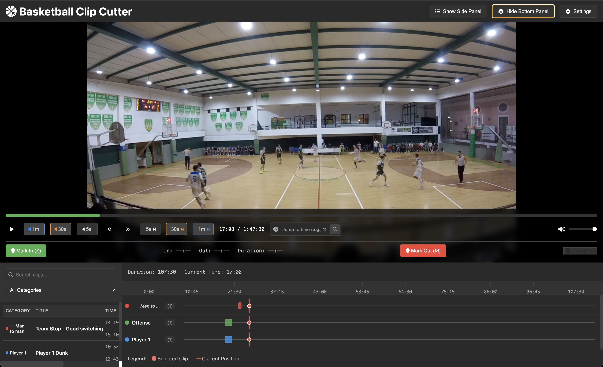

# 🏀 Basketball Video Analyzer

**Professional video analysis tool for basketball coaches and teams**


A powerful desktop application designed specifically for basketball coaches and analysts to cut, categorize, and organize video clips across multiple projects with reusable preset templates.



## 📥 Installation

### 🚀 Quick Install (Recommended)

**Download the latest version for your operating system:**

#### Windows

- **[Download Basketball Video Analyzer.exe](https://github.com/kauredo/basketball-video-analyzer/releases/latest/download/Basketball-Video-Analyzer-Setup.exe)** (Windows 10/11)
- Run the installer and follow the setup wizard
- The app will auto-update when new versions are available

#### macOS

- **[Download Basketball Video Analyzer.dmg](https://github.com/kauredo/basketball-video-analyzer/releases/latest/download/Basketball-Video-Analyzer.dmg)** (macOS 10.15+)
- Open the .dmg file and drag the app to Applications folder
- Right-click and "Open" the first time (due to macOS security)

#### Linux

**Ubuntu/Debian:**

- **[Download .deb package](https://github.com/kauredo/basketball-video-analyzer/releases/latest/download/basketball-video-analyzer.deb)**
- Install: `sudo dpkg -i basketball-video-analyzer.deb`

**Red Hat/Fedora:**

- **[Download .rpm package](https://github.com/kauredo/basketball-video-analyzer/releases/latest/download/basketball-video-analyzer.rpm)**
- Install: `sudo rpm -i basketball-video-analyzer.rpm`

**Other Linux:**

- **[Download .zip archive](https://github.com/kauredo/basketball-video-analyzer/releases/latest/download/basketball-video-analyzer-linux.zip)**
- Extract and run the executable

### 💻 System Requirements

#### Minimum Requirements

- **OS**: Windows 10, macOS 10.15, or Ubuntu 18.04+
- **RAM**: 4GB minimum, 8GB recommended
- **Storage**: 2GB free space (plus space for video clips)
- **CPU**: Intel i5 or AMD equivalent
- **GPU**: Any modern graphics card (for video playback)

#### Recommended for Large Videos (4K)

- **RAM**: 16GB
- **CPU**: Intel i7/AMD Ryzen 7 or better
- **Storage**: SSD recommended for video processing

#### Supported Video Formats

- **Input**: MP4, MOV, AVI, MKV, WebM
- **Output**: MP4 (H.264 for maximum compatibility)

---

## 🎯 What This App Does

This app solves the common problem of **creating organized video libraries for team analysis** across multiple games, opponents, and seasons. Instead of recreating category systems for every video, coaches can:

- ✅ Create project-specific clip libraries with consistent organization
- ✅ Build hierarchical category systems (parent categories with subcategories)
- ✅ Save category structures as reusable presets across projects
- ✅ Cut specific plays and automatically organize them in project folders
- ✅ **Jump to specific times** using HH:MM:SS search (new feature!)
- ✅ Export organized clip libraries to share with teams, players, or staff
- ✅ Maintain consistent video analysis workflows throughout the season

Perfect for building "Opponent Scouting" projects with reusable category presets, or creating "Player Development" libraries that maintain the same organizational structure across multiple sessions.

## ✨ Key Features

### 🎬 Advanced Video Cutting

- **Simple Mark & Cut**: Use `I` and `O` keys to mark in/out points during video playback
- **Time Search**: Jump to specific moments using HH:MM:SS format (e.g., 1:23:45, 12:30, or just 150 seconds)
- **Real Video Files**: Creates actual MP4 clips using FFmpeg (not just timestamps)
- **Precise Control**: Frame-by-frame navigation and comprehensive keyboard shortcuts

### 📁 Project-Based Organization

- **Multiple Projects**: Create separate projects for different games, opponents, or analysis types
- **Project Isolation**: Each project maintains its own categories and clips
- **Project Switching**: Seamlessly switch between projects while preserving all data
- **Organized Storage**: Clips are automatically organized by project in your file system

### 🏷️ Hierarchical Category System

- **Parent-Child Categories**: Create main categories with detailed subcategories (e.g., "Offense" → "Pick & Roll" → "Ball Screen High")
- **Unlimited Depth**: Build category hierarchies as deep as needed for your analysis
- **Multi-tagging**: Each clip can have multiple categories from different hierarchy branches
- **Visual Organization**: Color-coded categories with clear parent-child relationships

### 🎯 Preset Template System

- **Save Category Structures**: Save your complete category hierarchy as reusable presets
- **Multiple Presets**: Create different templates for different scenarios (Opponent Scouting, Player Development, etc.)
- **Load Across Projects**: Apply saved presets to new projects for consistent organization
- **Preset Management**: Save, load, and delete presets with user-friendly confirmation dialogs
- **Template Library**: Build a library of preset templates for different analysis types

### 📚 Enhanced Clip Library

- **Project-Specific Libraries**: Each project maintains its own complete clip collection
- **Visual Browser**: Thumbnail view of all clips with project context
- **Hierarchical Filtering**: Filter by parent categories or drill down to specific subcategories
- **Category Statistics**: See clip counts and total duration by category and subcategory
- **Cross-Project Overview**: Easily switch between project libraries

### 📤 Flexible Export System

- **Project-Based Export**: Export entire project libraries or selected categories
- **Batch Export**: Export all clips in selected categories while maintaining folder structure
- **Organized Folders**: Creates hierarchical folders by category for intuitive team sharing
- **Multiple Formats**: Exports to any directory for cloud sharing, USB distribution, or team platforms

### 🌐 Multi-Language Support

- **English and Portuguese**: Full interface translation support
- **Dynamic Language Switching**: Change languages without restarting the application
- **Localized Dialogs**: All confirmation dialogs and messages respect language selection

## 🚀 Quick Start Guide

### 1. Create or Select a Project

- Start by creating a new project or selecting an existing one from the project dropdown
- Each project maintains its own categories, clips, and organization
- Projects are perfect for organizing different games, opponents, or analysis types

### 2. Build Your Category System

#### Create Hierarchical Categories:

- Click **"Edit Categories"** to open the category management panel
- Add parent categories like `Offense`, `Defense`, `Special Situations`
- Add subcategories under parents: `Offense` → `Pick & Roll` → `Ball Screen High`
- Create unlimited category depth for detailed organization
- Choose colors for visual identification

#### Use Category Presets:

- **Save Presets**: After building your category structure, save it as a preset template
- **Load Presets**: Apply saved presets to new projects for consistent organization
- **Manage Presets**: Delete outdated presets to keep your template library organized
- **Perfect for**: Creating standardized category systems for scouting reports, player development sessions, or season-long analysis

### 3. Load Your Game Video

- Click **"Select Video"** and choose your basketball game file
- Supports: MP4, MOV, AVI, MKV, WebM formats
- Video loads within your current project context

### 4. Navigate and Cut Video Clips

#### Quick Time Navigation:

- **Time Search**: Use the time search box to jump to specific moments
  - Type `1:23:45` to jump to 1 hour, 23 minutes, 45 seconds
  - Type `12:30` to jump to 12 minutes, 30 seconds
  - Type `150` to jump to 150 seconds (2:30)
  - Press Enter or click the search button

#### Keyboard Shortcuts:

- **`Space`** - Play/Pause video
- **`I`** - Mark In point (start of clip)
- **`O`** - Mark Out point (end of clip)
- **`C`** - Clear marks
- **`←/→`** - Skip 5 seconds
- **`Alt + ←/→`** - Skip 30 seconds
- **`Ctrl/Cmd + ←/→`** - Skip 1 minute

#### Using Mouse:

- Click **"Mark In"** and **"Mark Out"** buttons
- Visual indicators show marked regions on video

### 5. Categorize Your Clip

- Select categories from your hierarchical structure (can select from multiple branches)
- Add detailed notes if needed (e.g., "Great defensive rotation - note help timing")
- Enter custom title or use auto-generated name with category context

### 6. Create the Clip

- Click **"Create Clip"**
- App uses FFmpeg to cut actual video file with project organization
- Progress bar shows cutting status
- Clips are automatically saved in project-specific folders

### 7. Manage Your Project Library

- View all clips in the **Clip Library** filtered by current project
- Use hierarchical filtering to drill down to specific subcategories
- Switch between projects to access different clip libraries
- Review category statistics to understand your analysis coverage

### 8. Export and Share

- Click **"Export"** to create organized folders by category hierarchy
- Maintain folder structure that matches your category organization
- Export specific categories or entire project libraries
- Share organized folders with team via cloud storage, USB, or team platforms

## 🎯 Typical Workflows

### Opponent Scouting Workflow

1. **Create Project**: "vs Team ABC - 2024 Conference Game"
2. **Load Preset**: Apply your standard "Opponent Scouting" category preset
3. **Video Analysis**: Load opponent game footage and cut relevant plays
4. **Quick Navigation**: Use time search to jump to specific plays (e.g., type `18:30` for a key moment)
5. **Categorize**: Organize clips by "Offense Schemes", "Defensive Sets", "Transition", etc.
6. **Export**: Create organized folders for coaching staff review
7. **Reuse**: Save any new categories back to your scouting preset for future games

### Player Development Workflow

1. **Create Project**: "Player 5 - Post Development Session 3"
2. **Load Preset**: Apply "Player Development" preset with skill-based categories
3. **Session Recording**: Cut clips from practice or game footage
4. **Time Navigation**: Jump to specific drill moments using time search
5. **Hierarchical Organization**: "Post Moves" → "Drop Steps" → "Strong Hand" vs "Weak Hand"
6. **Individual Review**: Export player-specific folders for one-on-one sessions
7. **Progress Tracking**: Compare with previous project libraries to track improvement

## ⌨️ Keyboard Shortcuts

| Key            | Action                   |
| -------------- | ------------------------ |
| `Space`        | Play/Pause video         |
| `I`            | Mark In (start of clip)  |
| `O`            | Mark Out (end of clip)   |
| `C`            | Clear marks              |
| `←`            | Skip backward 5 seconds  |
| `→`            | Skip forward 5 seconds   |
| `Alt + ←`      | Skip backward 30 seconds |
| `Alt + →`      | Skip forward 30 seconds  |
| `Ctrl/Cmd + ←` | Skip backward 1 minute   |
| `Ctrl/Cmd + →` | Skip forward 1 minute    |
| `Shift + ←`    | Previous frame           |
| `Shift + →`    | Next frame               |

## 📁 File Organization

The app automatically organizes your files with project-based structure:

```
📁 App Data Folder/
├── 📁 clips/                           # All created video clips organized by project
│   ├── 📁 Project_1_vs_Team_ABC/       # Individual project folders
│   │   ├── 🎬 Offense_PickRoll_001.mp4
│   │   ├── 🎬 Defense_Rotation_002.mp4
│   │   └── ...
│   ├── 📁 Project_2_Player_Development/
│   │   ├── 🎬 Player5_PostMoves_001.mp4
│   │   └── ...
│   └── ...
├── 📄 basketball-analyzer.db           # Database with projects, categories, presets, and clip metadata
└── 📁 presets/                         # Saved category preset templates
    ├── 📄 opponent_scouting.json
    ├── 📄 player_development.json
    └── ...
```

## 🚨 Troubleshooting

### Installation Issues

#### Windows

- **"Windows protected your PC"**: Click "More info" → "Run anyway" (app is not yet code-signed)
- **Installation fails**: Run as administrator
- **App won't start**: Install [Visual C++ Redistributable](https://docs.microsoft.com/en-us/cpp/windows/latest-supported-vc-redist)

#### macOS

- **"App can't be opened"**: Right-click app → "Open" → "Open" (bypass Gatekeeper)
- **Permission denied**: Check System Preferences → Security & Privacy → General
- **App crashes**: Ensure macOS 10.15+ and check Console for errors

#### Linux

- **Package conflicts**: Install with `--force-depends` flag
- **Missing dependencies**: Install `libgtk-3-0`, `libxss1`, `libgconf-2-4`
- **Permission errors**: Run with `sudo` or check file permissions

### Video Issues

- **Video won't load**: Ensure format is supported (MP4, MOV, AVI, MKV, WebM)
- **Playback stutters**: Close other applications or try lower resolution video
- **Audio issues**: Check system audio settings and volume controls

### Performance Issues

- **Slow clip creation**: Large 4K videos may take longer to process
- **App runs slowly**: Close other resource-heavy applications
- **Out of memory**: Ensure sufficient RAM for video size

### Can't Find Files

- Click **"Open Clips Folder"** to locate created clips
- Default location varies by OS:
  - **Windows**: `%APPDATA%/basketball-video-analyzer/clips/`
  - **macOS**: `~/Library/Application Support/basketball-video-analyzer/clips/`
  - **Linux**: `~/.config/basketball-video-analyzer/clips/`

## 🔄 Updates

The app automatically checks for updates on startup. When a new version is available:

1. You'll see a notification in the app
2. Click "Download Update" to get the latest version
3. The app will restart with new features and bug fixes

## 📞 Support

Having issues? We're here to help:

- **📖 Documentation**: Check this README for common solutions
- **🐛 Bug Reports**: [Create an issue on GitHub](https://github.com/kauredo/basketball-video-analyzer/issues)
- **💡 Feature Requests**: [Suggest new features](https://github.com/kauredo/basketball-video-analyzer/issues)
- **📧 Email Support**: contact@basketballvideoanalyzer.com

## 🤝 Contributing

We welcome contributions from the basketball and developer communities:

1. Fork the repository
2. Create a feature branch (`git checkout -b feature/amazing-feature`)
3. Commit your changes (`git commit -m 'Add amazing feature'`)
4. Push to the branch (`git push origin feature/amazing-feature`)
5. Open a Pull Request

## 📄 License

**Free for Basketball Teams and Personal Use**

This software is free to use for:
- ✅ Basketball teams and coaches (any level)
- ✅ Educational institutions
- ✅ Personal/individual use
- ✅ Non-commercial purposes

**Restrictions:**
- ❌ Cannot be sold or commercialized
- ❌ Cannot be redistributed for profit
- ❌ Modified versions cannot be distributed

For commercial licensing inquiries, contact: contact@basketballvideoanalyzer.com

See the [LICENSE](LICENSE) file for complete terms.

---

## 🚀 For Developers

### Development Setup

#### Prerequisites

- **Node.js** 16+ and **npm**
- **Git** for cloning the repository

#### Installation

```bash
# Clone the repository
git clone https://github.com/kauredo/basketball-video-analyzer.git
cd basketball-video-analyzer

# Install dependencies
npm install

# Start development environment
npm run dev
```

#### Build and Package

```bash
# Build the application
npm run build

# Create distributable packages for all platforms
npm run make:all

# Create a release (bump version + build + package)
npm run release
```

#### Project Structure

```
src/
├── main/           # Electron main process
├── renderer/       # React frontend
├── types/          # TypeScript definitions
└── i18n/          # Internationalization
```

---

**Built for coaches, by coaches** 🏀

_Making systematic basketball analysis efficient, organized, and repeatable._
